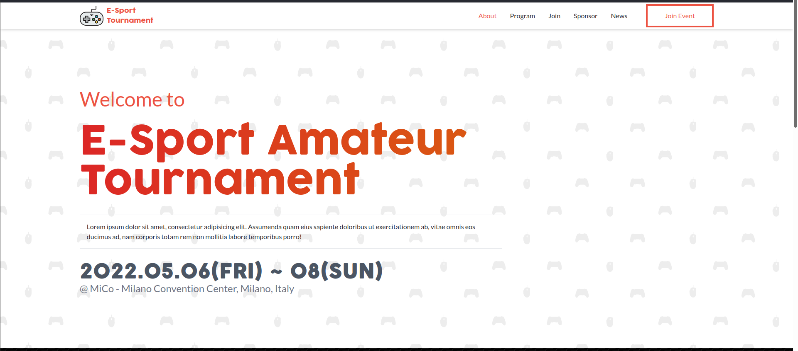
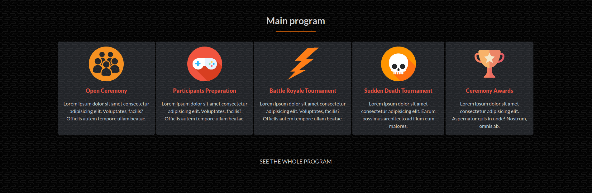
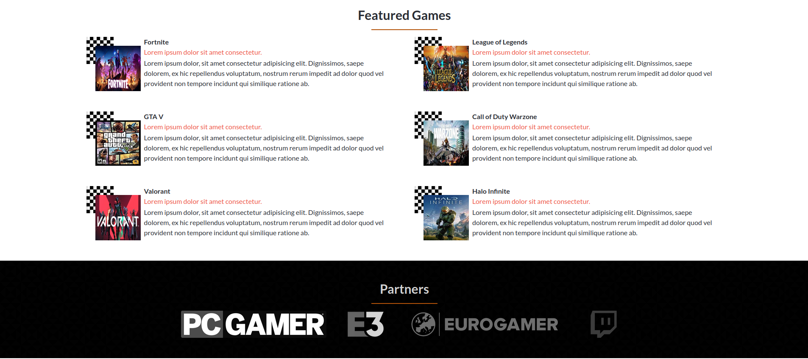
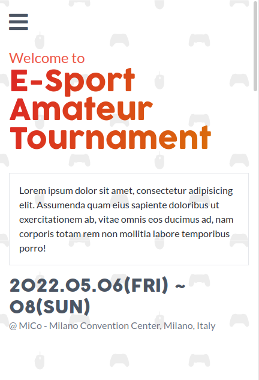
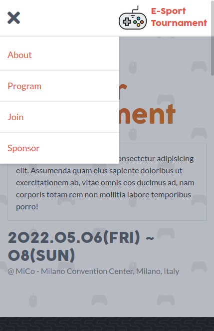

# 🏆 E-Sport Tournament 🎮

This project is mock webpage based on a fictional tournament going to happen on May, 2022.

### 🖥️ Desktop version

Here is a showcase for the desktop version:

#### Home page

#### Program

#### Features and Partners

### 📱 Mobile version

Here are some features for the mobile version:

#### Home page

#### Nav menu

## ✅ Learning objectives

- Use semantic HTML tags.
- Apply best practices in HTML code.
- Use CSS selectors correctly.
- Use CSS box model.
- Use Flexbox to place elements in the page.
- Demonstrate ability to create UIs adaptable to different screen sizes using media queries.
- Use GitHub Pages to deploy web pages.
- Apply JavaScript best practices and language style guides in code.
- Use JavaScript to manipulate DOM elements.
- Use JavaScript events.
- Use objects to store and access data.
- Communicate technical concepts to other technical people.

## 🧩 Built With

- HTML & CSS
- Javascript
- TailwindCSS
- Linters

## 📚 Getting Started

To get a local copy up and running follow these simple example steps.

### Prerequisites

For this project to run you will need the following tools:

- TailwindCSS
- PostCSS
- PostCSS-import

### Setup

Fork a copy to your repository

### Install

Follow the installation guidelines for:

- [TailwindCSS](https://tailwindcss.com/docs/installation)
- [PostCSS](https://github.com/postcss/postcss#usage)
- [PostCSS-import](https://github.com/postcss/postcss-import)

### Usage

You can work in your favorite Code Editor

## 💻📱 Live Preview

<!-- There is no Live Demo available at the moment -->

If you want to see a live demo of this project, [click here](https://williamrolando88.github.io/es-tournament/)

## Authors

👤 **William Morales**

- GitHub: [@williamrolando88](https://github.com/williamrolando88)
- Twitter: [@WillyMorales93](https://twitter.com/WillyMorales93)
- LinkedIn: [William Morales](https://www.linkedin.com/in/william-morales-palma/)

## 🤝 Contributing

Contributions, issues, and feature requests are welcome!

Feel free to check the [issues page](/**/issues).

## 👏 Show your support

Give a ⭐️ if you like this project!

## 👍 Credits

GUI & Graphic Design: Cindy Shin

- Behance: [Cindy Shin](https://www.behance.net/adagio07)

## 📝 License

Copyright (c) 2021 William Morales

Permission is hereby granted, free of charge, to any person obtaining a copy of this software and associated documentation files (the "Software"), to deal in the Software without restriction, including without limitation the rights to use, copy, modify, merge, publish, distribute, sublicense, and/or sell copies of the Software, and to permit persons to whom the Software is furnished to do so, subject to the following conditions:

The above copyright notice and this permission notice shall be included in all copies or substantial portions of the Software.

THE SOFTWARE IS PROVIDED "AS IS", WITHOUT WARRANTY OF ANY KIND, EXPRESS OR IMPLIED, INCLUDING BUT NOT LIMITED TO THE WARRANTIES OF MERCHANTABILITY, FITNESS FOR A PARTICULAR PURPOSE AND NONINFRINGEMENT. IN NO EVENT SHALL THE AUTHORS OR COPYRIGHT HOLDERS BE LIABLE FOR ANY CLAIM, DAMAGES OR OTHER LIABILITY, WHETHER IN AN ACTION OF CONTRACT, TORT OR OTHERWISE, ARISING FROM, OUT OF OR IN CONNECTION WITH THE SOFTWARE OR THE USE OR OTHER DEALINGS IN THE SOFTWARE.
